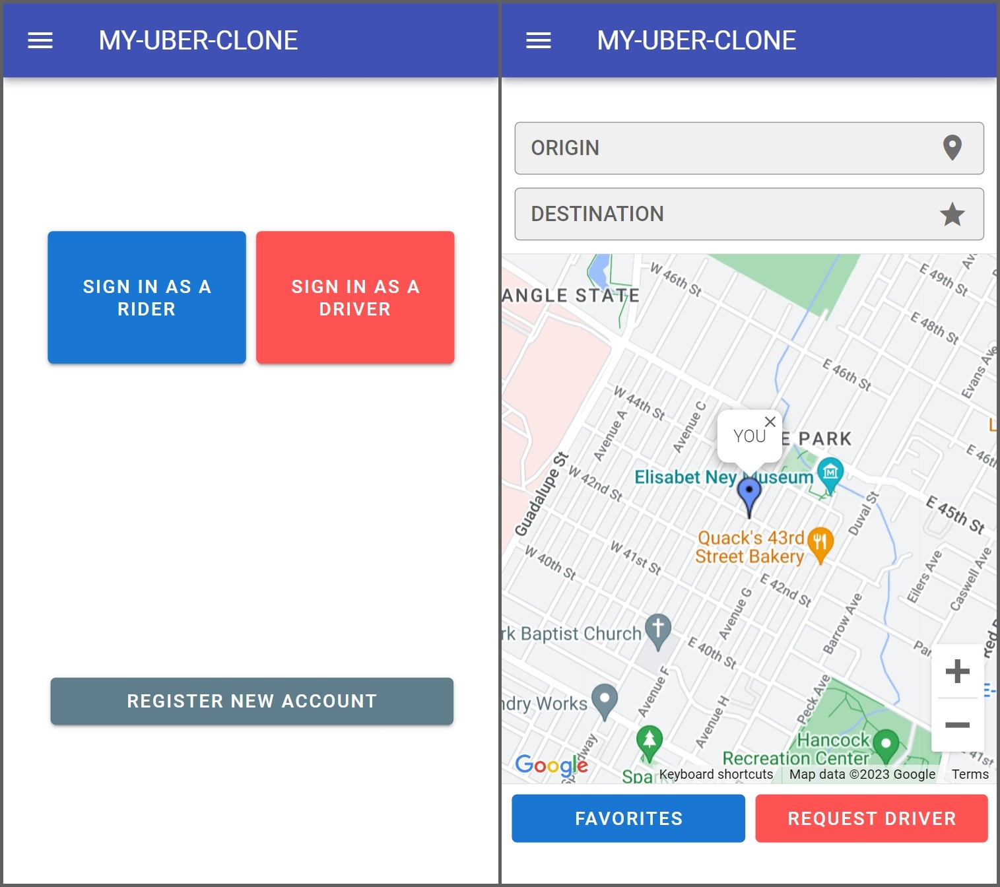
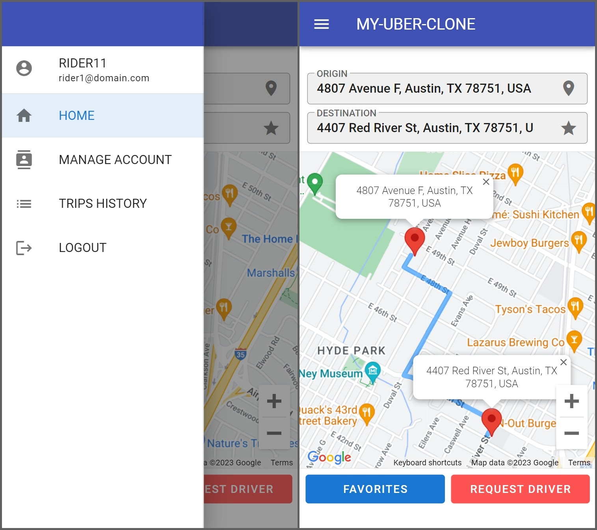
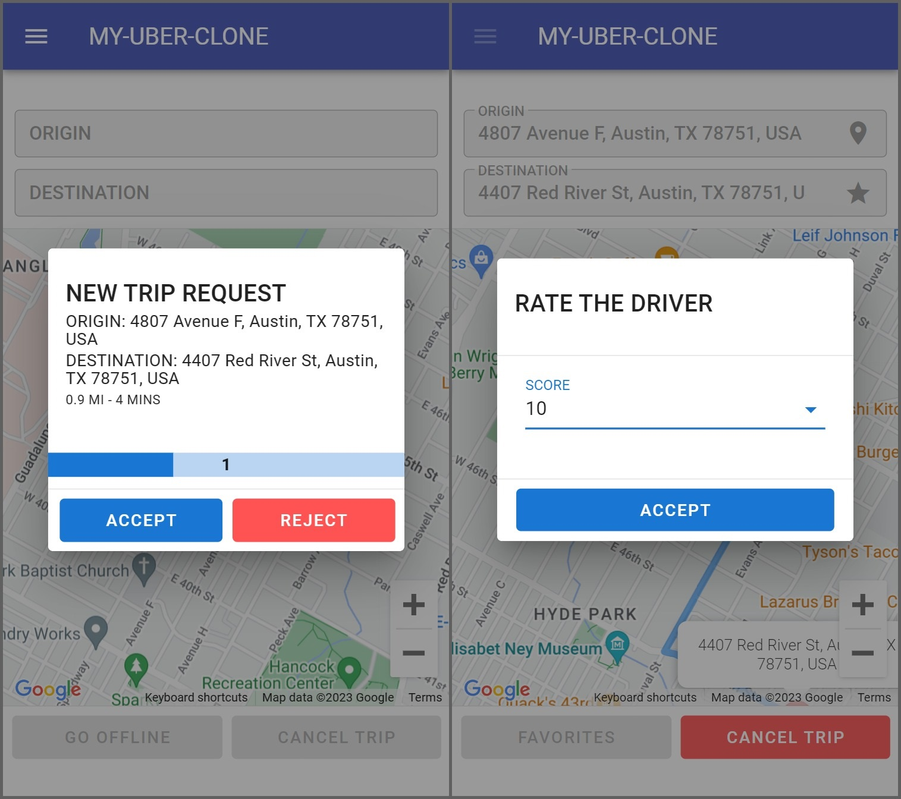

# Uber Clone with Vue.js and Firebase

An Uber-like Android app developed with Firebase, Google Maps, and Apache Cordova.

## Technologies
- Firebase
- JavaScript
- Maps JavaScript API
- Vue.js
- Vuetify.js Material Design Component Framework
- Vuex

## Install dependencies
npm install

## Serve with hot reload at localhost:8080
npm run serve

## Build for production
npm run cordova_build

## Enabled APIs
- Directions API
- Firebase App Check API
- Firebase Dynamic Links API
- Firebase Realtime Database API
- Geocoding API
- Identity Toolkit API
- Maps JavaScript API
- Places API
- Token Service API

## Screenshots

## Resources

- *[Documentation | Firebase](https://firebase.google.com/docs)*
- *[Documentation | Vue.js](https://vuejs.org/v2/guide/)*
- *[Xamarin Android Uber Clone](https://www.udemy.com/course/xamarin-uber-clone-app/)*
